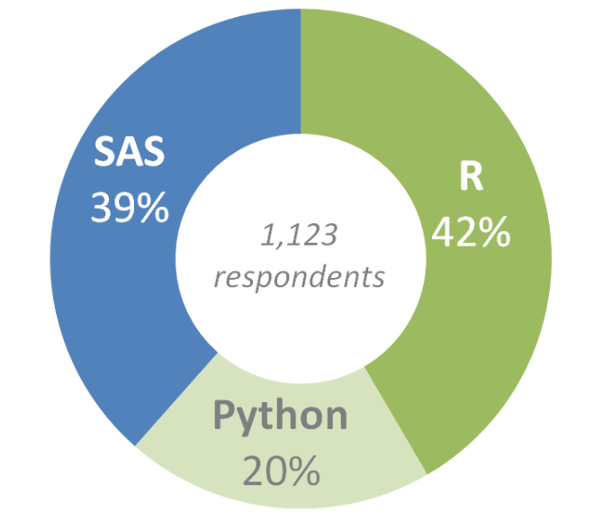
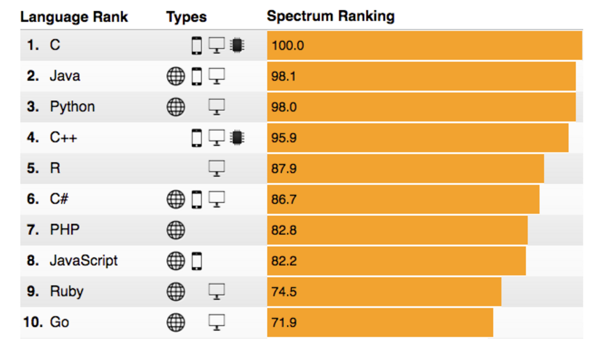
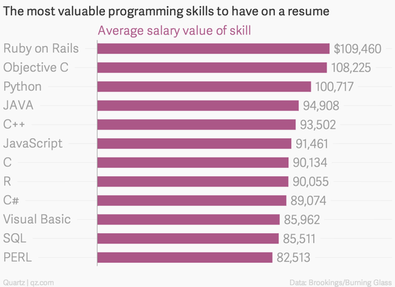

## Why R

R is favorate language by most data scientists

</img>

<p>http://www.burtchworks.com/2016/07/13/sas-r-python-survey-2016-tool-analytics-pros-prefer/</p>

## Why R

R is popular

</img>

http://spectrum.ieee.org/computing/software/the-2016-top-programming-languages

## Why R

Good salary with R skills

</img>

http://www.businessinsider.com/best-tech-skills-resume-ranked-salary-2014-11

## Coding Style

It is important to have a good R coding style so that your code can be easily shared to others

- [Hadley Wickham's Style Guide](http://adv-r.had.co.nz/Style.html)
- [Google's R Style Guide](https://google.github.io/styleguide/Rguide.xml)

They are similar to each other, so adhring to either one should be good enough

## Basics About R

R is a functional, object-based language

- EVERYTHING that exists in R is an **OBJECT**
- EVERYTHING that happens in R is a **FUNCTION** call
- **INTERFACES** to other software are part of R

## Everything is an object

```
x <- rnorm(100)
```

**everything** is an object including vector and functions

```
class(x)
class(rnorm)
class(`<-`)

str(x) # structure of x
typeof(x) # storage mode of x

```

## Everything is a Function Call

``` x <- rnorm(100)``` has two function calls:

- rnorm(100) to generate 100 random numbers
- `<-` assign the 100 randmo numbers to x

`<-` is called operator, it does the same thing as

```
`<-`(x, rnorm(100))
class(`<-`)
```

The backticks `` are useful when object names are not syntactially leagal.

```
`my object` <- 123
`my object` + 1
```

## Everything is a Function call

```
x[1:10]
`[`(x, `:`(1, 10))

mtcars[1:10, ]
`[`(mtcars, 1:10,)
```

## Operators

Operators, as objects, are simple functions

Operators in base package

```
"!" "!=" "$" "$<-" "%%" "%*%" "%/%" "%in%" "%o%" 
"%x%" "&" "&&" "(" "*" "+" "-" "/" ":" "::" ":::" 
"<" "<-" "<<-" "<=" "=" "==" ">" ">=" "@" "[" "[<-"
"[[" "[[<-" "^" "{" "|" "||" 111
```

We can overwrite the operator (Don't use it in real practice)

```
`+` <- function(e1, e2) e1 * e2
4 + 6

`[` <- function(x, y) x + y
x <- 1:5
x[5]
```

## Operators

Practically, we can define our own operators using ```%text%```

```
`%max%` <- function(x, y) max(x, y)
3 %max% 5 %max% 1
```

One important example is ```%>%``` often used with **dplyr**

```
library(dplyr)
mtcars %>% mutate(carb = carb + 4)

?`%>%`
```

Another useful application is **+** in **ggplot2** pakcage

```
library(ggplot2)
ggplot(mtcars, aes(mpg, hp)) + geom_line() + geom_point()
```
This overrides + operator for ggplot class

